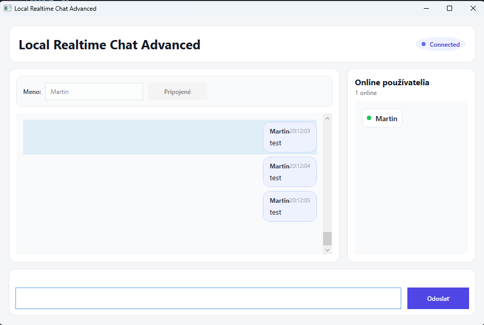
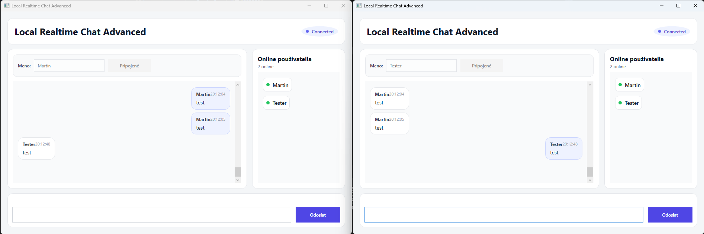
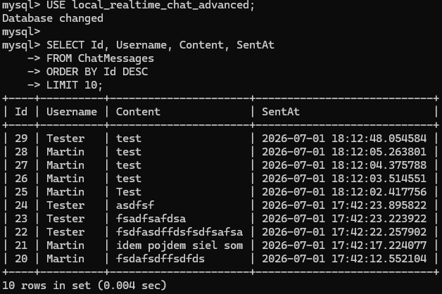

# LocalRealtimeChatAdvanced

LocalRealtimeChatAdvanced je rozšírená verzia lokálnej chatovacej aplikácie v reálnom čase vytvorená ako technické zadanie.

Projekt nadväzuje na základnú verziu LocalRealtimeChat a pridáva ďalšie funkcie, ktoré zlepšujú používateľský zážitok, prehľadnosť aplikácie a prácu s WebSocket komunikáciou.

Riešenie obsahuje:

* desktopovú aplikáciu WPF
* backend API postavené na ASP.NET Core
* natívnu komunikáciu cez WebSocket
* databázu MySQL
* Entity Framework Core pre prístup k databáze
* zoznam online používateľov
* typing indicator
* krajšie používateľské rozhranie
* správy zobrazené ako chatové bubliny

Aplikácia beží lokálne. Viacerí WPF klienti sa môžu pripojiť k backendu a komunikovať medzi sebou v reálnom čase.

## Technológie

* C#
* .NET
* WPF
* ASP.NET Core
* WebSocket
* MySQL
* Entity Framework Core
* Pomelo EntityFrameworkCore MySQL provider

## Funkcionalita

* pripojenie na lokálny WebSocket server
* odosielanie správ v reálnom čase
* okamžité prijímanie správ vo všetkých pripojených klientoch
* ukladanie správ do MySQL databázy
* načítanie histórie správ po pripojení
* zoznam online používateľov
* typing indicator
* rozlíšenie vlastných a cudzích správ
* správy zobrazené ako chatové bubliny
* jednoduché a prehľadnejšie používateľské rozhranie vo WPF
* WebSocket message protocol s typmi správ
* lokálne vývojové prostredie

## Screenshoty

### Hlavné okno aplikácie



### Komunikácia medzi dvomi klientmi



### Uložené správy v databáze



## Štruktúra projektu

```text
LocalRealtimeChatAdvanced/
│
├── LocalRealtimeChat.Api/
│   ├── Data/
│   │   ├── AppDbContext.cs
│   │   └── AppDbContextFactory.cs
│   ├── Models/
│   │   ├── ChatMessage.cs
│   │   ├── ChatMessageDto.cs
│   │   ├── WebSocketEnvelope.cs
│   │   └── WebSocketMessageTypes.cs
│   ├── WebSockets/
│   │   └── ChatWebSocketHandler.cs
│   ├── Migrations/
│   ├── Program.cs
│   └── appsettings.json
│
├── LocalRealtimeChat.Wpf/
│   ├── Models/
│   │   ├── ChatMessageDto.cs
│   │   ├── WebSocketEnvelope.cs
│   │   └── WebSocketMessageTypes.cs
│   ├── Services/
│   │   └── WebSocketChatClient.cs
│   ├── MainWindow.xaml
│   └── MainWindow.xaml.cs
│
├── docs/
│   └── screenshots/
│       ├── advanced-chat-window.png
│       ├── advanced-two-clients.png
│       └── advanced-database.png
│
├── LocalRealtimeChatAdvanced.slnx
├── .gitignore
└── README.md
```

## WebSocket message protocol

Advanced verzia používa jednoduchý typovaný WebSocket protokol.

Namiesto posielania iba obyčajného textu sa správy posielajú ako objekt s typom a obsahom:

```json
{
  "type": "chat_message",
  "payload": {
    "username": "Martin",
    "content": "Ahoj",
    "sentAt": "2026-07-01T18:30:00"
  }
}
```

Používané typy správ:

```text
user_joined
chat_message
history_message
online_users
typing_started
typing_stopped
error
```

Tento prístup umožňuje cez jedno WebSocket spojenie posielať nielen chatové správy, ale aj ďalšie real-time udalosti, napríklad online používateľov alebo informáciu o tom, že používateľ práve píše.

## Nastavenie databázy

Vytvor MySQL databázu a používateľa:

```sql
CREATE DATABASE local_realtime_chat_advanced
CHARACTER SET utf8mb4
COLLATE utf8mb4_unicode_ci;

CREATE USER 'chatapp'@'localhost' IDENTIFIED BY 'chatapp123';

GRANT ALL PRIVILEGES ON local_realtime_chat_advanced.* TO 'chatapp'@'localhost';

FLUSH PRIVILEGES;
```

Ak používateľ `chatapp` už existuje z pôvodného projektu, stačí použiť:

```sql
CREATE DATABASE local_realtime_chat_advanced
CHARACTER SET utf8mb4
COLLATE utf8mb4_unicode_ci;

GRANT ALL PRIVILEGES ON local_realtime_chat_advanced.* TO 'chatapp'@'localhost';

FLUSH PRIVILEGES;
```

Connection string sa nachádza v:

```text
LocalRealtimeChat.Api/appsettings.json
```

Predvolený connection string:

```json
"server=localhost;port=3306;database=local_realtime_chat_advanced;user=chatapp;password=chatapp123"
```

Ide o lokálnu demo konfiguráciu pre účely zadania.

## Aplikovanie databázovej migrácie

Z koreňového priečinka spusti:

```cmd
dotnet ef database update --project LocalRealtimeChat.Api --startup-project LocalRealtimeChat.Api
```

## Spustenie backendu

Z koreňového priečinka spusti:

```cmd
dotnet run --project LocalRealtimeChat.Api
```

Predvolená URL backendu:

```text
http://localhost:5065
```

WebSocket endpoint:

```text
ws://localhost:5065/ws/chat
```

## Spustenie WPF klienta

Otvor ďalší terminál a spusti:

```cmd
dotnet run --project LocalRealtimeChat.Wpf
```

Pre otestovanie komunikácie v reálnom čase spusti klienta dvakrát v dvoch samostatných termináloch.

Príklad:

```cmd
dotnet run --project LocalRealtimeChat.Wpf
dotnet run --project LocalRealtimeChat.Wpf
```

Použi rôzne používateľské mená v oboch oknách a posielaj správy medzi nimi.

## Ako to funguje

1. WPF klient sa pripojí k backendu cez WebSocket.
2. Po pripojení klient odošle správu typu `user_joined`.
3. Backend si k WebSocket spojeniu uloží meno používateľa.
4. Backend odošle klientovi históriu správ z databázy.
5. Pri prijatí novej chatovej správy ju backend uloží do MySQL databázy.
6. Uložená správa sa odošle všetkým pripojeným klientom.
7. Pri pripojení alebo odpojení klienta backend aktualizuje zoznam online používateľov.
8. Pri písaní správy klient posiela udalosti `typing_started` a `typing_stopped`.

## Rozdiel oproti základnej verzii

Oproti základnému projektu LocalRealtimeChat advanced verzia pridáva:

* krajšie WPF rozhranie
* chatové bubliny
* rozlíšenie vlastných a cudzích správ
* online používateľov
* typing indicator
* typovaný WebSocket protokol
* čistejšiu prácu s viacerými druhmi WebSocket udalostí

## Poznámky

Tento projekt zámerne používa natívnu WebSocket komunikáciu namiesto SignalR.

Cieľom je udržať komunikáciu v reálnom čase jednoduchú, transparentnú a ľahkú pre lokálne technické zadanie.

REST polling sa na chatové správy nepoužíva.
